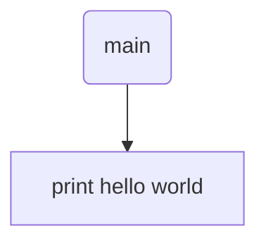

# Documentation tools
Notes on documentation tools
## Using mermaid to draw and present flow charts and diagrams
[Mermaid](mermaid.md)

```mermaid
flowchart TD
    Start(main) --> Sub[print hello world]
```
