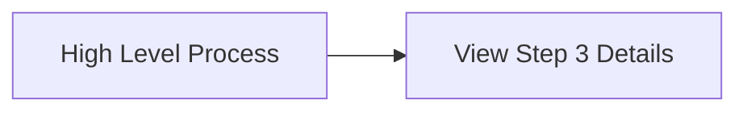
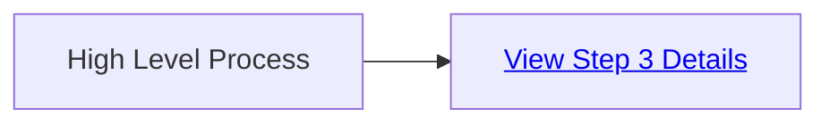
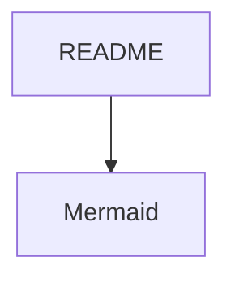

# Mermaid for diagrams and flow charts

[cheatsheet](https://jojozhuang.github.io/tutorial/mermaid-cheat-sheet/)

## Click
- Using anchor tag `<a>`  of html (which works in VS code markdown preview)
- Using `click` of mermaid (Did not work in VS code markdown preview) 

### Opening Relative Paths (Local Files)
If you want a node to open another file in your local directory or repository (like a sub-diagram or documentation page), use a relative file path.

#### with 

### Step 3: Detailed Breakdown